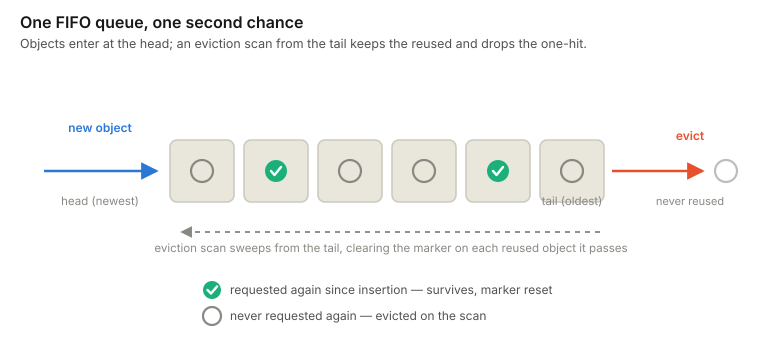

+++
title = 'Why FIFO Is (Almost) All You Need for Cache Eviction'
date = 2026-07-28T11:00:00-04:00
author = 'Juncheng Yang'
draft = false
tags = ['caching', 'systems', 'cache-eviction', 'FIFO', 'S3-FIFO', 'SIEVE']
showToc = true
summary = 'LRU tries to rank everything. Production traces showed that caches need something simpler: reject one-hit objects quickly and delay promotion until it matters.'
+++

Cache eviction is usually presented as a ranking problem. LRU ranks objects by
recency. LFU ranks them by frequency. More advanced algorithms combine several
signals, adapt their parameters, and maintain increasingly sophisticated data
structures to decide which object is least valuable.

<!--more-->

For decades, the direction of progress seemed obvious: a more accurate ranking
should produce a better cache.

Production workloads pointed us somewhere else. The dominant problem was not
that caches ranked valuable objects poorly. It was that they spent too much
time ranking objects with no value to rank.

## The workload changed the question

Across production cache traces, a large fraction of objects are requested once
and never reused while they are resident in the cache.[^onehit] These objects
are often called one-hit wonders. They consume space, displace useful data,
and disappear without producing a single cache hit.

This effect is easy to underestimate. An object may appear twice in the full
trace and therefore look reusable. But if its second request arrives long
after any practical cache would have evicted the first copy, the cache
experiences two separate one-hit objects. What matters is not reuse somewhere
in the trace; it is reuse before eviction.

Once we looked at the workload this way, cache eviction stopped looking like
one ranking problem. It became two filtering problems:

- Quick demotion: How quickly can the cache remove a new object that has
  shown no evidence of reuse?
- Lazy promotion: How long can the cache wait before rewarding an object
  that has been reused?

We described these principles in
[FIFO Can Be Better than LRU: The Power of Lazy Promotion and Quick Demotion](https://sigops.org/s/conferences/hotos/2023/papers/yang.pdf).
They explain why a simple FIFO queue can outperform policies designed to track
the workload much more precisely.

## Where LRU spends the wrong work

LRU gives every new object the most privileged position in the cache: the head
of the queue. A one-hit object must travel through the entire queue before it
can be evicted. During a scan or burst of new traffic, many useless objects
receive this protection at once and push out data that would have been reused.
LRU demotes new objects too slowly.

LRU is also eager on a hit. Every access moves an object back to the head. In a
concurrent cache, that move means synchronization, pointer updates, and cache
coherence traffic. A popular object may be promoted thousands of times even
though the first promotion already moved it far from eviction.

FIFO has the opposite behavior. New objects advance steadily toward eviction,
so a one-hit object leaves after one pass through the queue. Hits do not change
the global ordering, so the cache avoids mutations on its hottest path.

Plain FIFO goes too far: it will eventually evict even a frequently requested
object. The useful design point lies just beyond it.

> Start with FIFO, then spend the smallest possible amount of state on a
> second chance.

## One bit of evidence

The basic second-chance mechanism is almost embarrassingly small. A new object
enters a FIFO queue with no evidence of reuse. A hit records one small piece of
evidence—a bit or a tiny counter—but does not move the object. Only when the
object approaches eviction does the cache decide whether that evidence earns
more time.

This delay is important. At insertion, the cache knows nothing about the
object. At the first hit, it knows the object was useful once. At eviction, it
knows both that the object has been reused and that keeping it now requires
evicting something else. The cache makes the expensive decision only when the
decision matters.

This idea produced two related algorithms:
[S3-FIFO](https://dl.acm.org/doi/10.1145/3600006.3613147)[^s3fifo] and
[SIEVE](https://www.usenix.org/system/files/nsdi24-zhang-yazhuo.pdf).[^sieve]
They share the same workload insight, but spend their second chance
differently.

## S3-FIFO: filter first, protect later

S3-FIFO uses three static FIFO queues:

- A small queue admits new objects and quickly filters out one-hit wonders.
- A main queue holds objects that have demonstrated reuse.
- A ghost queue stores only the keys of recently evicted objects, not their
  data.

Most new objects enter the small queue, which uses roughly 10% of the cache.
When an object reaches its tail, an object with no reuse is evicted. If the
object was requested again, it graduates to the main queue.

The ghost queue catches reuse that arrives just too late. When an evicted key
is requested again, the cache now has evidence that the object is recurring,
so it can bypass the small filter and enter the main queue directly.

The main queue provides longer-term protection without maintaining an exact
recency order. Hits update a small frequency counter rather than moving an
object immediately. At eviction time, the counter determines whether the
object leaves or receives another turn.

The queues have different jobs: the small queue supplies quick demotion, the
main queue supplies lazy promotion, and the ghost queue connects evidence
across cache residencies.

## SIEVE: leave the object where it is

SIEVE reduces the same insight to one queue, one visited bit per object, and
one moving hand.

New objects enter at the head. A hit sets the object's visited bit but does not
move it. When the cache needs space, the hand examines eviction candidates. If
an object has been visited, SIEVE clears the bit, leaves the object in place,
and advances the hand. The first unvisited object is evicted.

The hand does not restart from the tail after every eviction. It remembers its
position and continues from there the next time the cache needs space. This
small detail makes SIEVE different from a conventional second-chance queue:
objects survive in place rather than being reinserted at the head.

That means a hit never changes the queue. It performs no list operation and
needs no lock on the global eviction order. The design is simple enough to add
to an existing cache in a few lines, yet the parked hand prevents the repeated
tail scans that would otherwise waste work.

| | S3-FIFO | SIEVE |
| --- | --- | --- |
| Queue structure | Small, main, and ghost queues | One queue |
| Hit path | Update a tiny frequency counter | Set one visited bit |
| Second chance | Promote or reinsert at eviction | Clear the bit and leave the object in place |
| Main strength | Robust filtering across diverse workloads | Minimal implementation and synchronization |

## Simpler is also faster

These algorithms were designed from a workload observation, but their
simplicity produces a second benefit: scalability.

Across 6,594 traces from 14 datasets, S3-FIFO achieved a lower miss ratio
than each of 12 state-of-the-art algorithms in the comparison. On some
traces it reduced LRU's miss ratio by as much as 72%. In a separate
comparison, it matched LRU's hit ratio with roughly 46% less memory.

SIEVE, despite using less machinery, reduced ARC's miss ratio by up to
63.2% on skewed web workloads. Across the full evaluation, it was more
consistently competitive than algorithms with substantially more metadata and
adaptation logic.

The hit path is where the engineering difference becomes most visible. LRU
must coordinate updates to a shared order on every hit. FIFO-based algorithms
record local metadata and defer queue maintenance until eviction, which occurs
far less often.

At 16 threads, S3-FIFO sustained about 6× the throughput of an optimized
LRU implementation. Its sequential queue operations are also friendlier to
flash, where random rewrites increase write amplification and wear. SIEVE was
integrated into five production cache libraries with fewer than 20 lines of
change on average, and its prototype achieved about 2× the throughput of
an optimized 16-thread LRU.

This combination—lower miss ratios, fewer shared mutations, and small
implementations—helped the algorithms move beyond papers into production
systems and open-source cache libraries.

## Why "almost" matters

The argument is not that plain FIFO is universally optimal. No online eviction
algorithm wins on every workload, and pure FIFO can discard a hot object simply
because it is old.

The claim is that FIFO is a better starting point than we gave it credit for.
Once a cache can quickly discard one-hit wonders and give reused objects a
carefully delayed second chance, much of the value attributed to sophisticated
ranking appears without the ranking.

This changes how I think about cache design:

- Count metadata work as well as misses. A policy that saves a few misses
  by mutating a global list on every request may lose at the system level.
- Separate admission from protection. New objects have not earned the
  same treatment as objects with demonstrated reuse.
- Delay decisions until they matter. Eviction time contains more evidence
  than insertion time or the first hit.
- Make complexity justify itself. Every queue, counter, parameter, and
  lock should correspond to a workload behavior we can measure.

[^onehit]: This one-hit-wonder effect is quantified across the production
traces in the S3-FIFO study. On many web and key-value workloads, most
objects receive no second request during their effective cache lifetime,
even when they reappear much later in the complete trace.

[^s3fifo]: Juncheng Yang, Yazhuo Zhang, Ziyue Qiu, Yao Yue, and K. V. Rashmi.
"FIFO queues are all you need for cache eviction." In Proceedings of the
29th ACM Symposium on Operating Systems Principles (SOSP '23), 2023.
Project page: [https://s3fifo.com](https://s3fifo.com).

[^sieve]: Yazhuo Zhang, Juncheng Yang, Yao Yue, Ymir Vigfusson, and K. V.
Rashmi. "SIEVE is Simpler than LRU: an Efficient Turn-Key Eviction
Algorithm for Web Caches." In Proceedings of the 21st USENIX Symposium on
Networked Systems Design and Implementation (NSDI '24), 2024. Project
page: [https://sieve-cache.com](https://sieve-cache.com).
