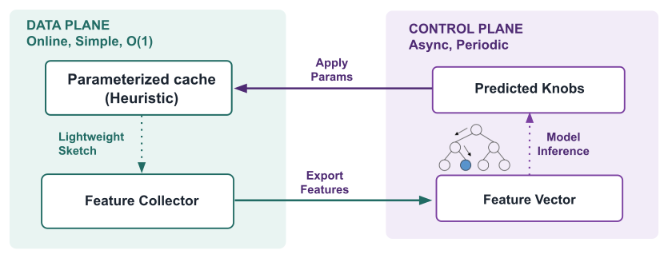

+++
title = 'Learning-Augmented Heuristics: A Different Way to Build Smart Caches'
date = 2026-08-08T00:00:00-05:00
author = 'William Nixon'
draft = true
tags = ['caching', 'systems', 'machine-learning', 'S3-FIFO']
showToc = true
summary = 'Smart cache eviction algorithms can adapt to workloads, but they often pay for it with complexity, instability, or overhead. Learning-Augmented Heuristics takes a different approach: keep the fast heuristic on the data path, and use learning to configure it at a slower timescale.'
bio = 'William is a 2nd-year PhD student in Computer Science at the University of Chicago, advised by Prof. Haryadi S. Gunawi and Prof. Juncheng Yang. He works on systems and machine learning, with a focus on caching and storage.'
+++

Cache eviction research has spent years producing "smart" caches: ARC, LeCaR,
LRB, LHD, GL-Cache, 3L-Cache. Each adapts to the workload in some way, and
each has, at some point, outperformed the classic heuristics in their evaluations.
Many of these algorithms incorporate some form of learning or online adaptation.

Yet despite their promise in efficiency, production caches still largely rely
on static heuristics such as LRU, 2Q, and FIFO variants.

That gap is interesting. If smart caches can achieve better miss ratios, why
have they seen so little adoption?

This led us to a different question: **is the problem with learning itself, or
with where and how we have been using it?**

In our OSDI '26 paper,[^s4fifo] we explore the latter. Our answer is a design
principle we call **Learning-Augmented Heuristics (LAH)**: keep a simple
heuristic in charge of request serving, and use a pre-trained model to configure
that heuristic for the workload.

## Why haven't smart caches taken over?

A cache eviction algorithm sits directly on the request path, so improving miss
ratio is only part of the job. A practical policy also needs to be fast enough
not to become a bottleneck, robust across workloads, reasonably simple to
deploy, and understandable when something goes wrong.

The idea of adaptive eviction is very appealing. A static policy applies the
same rules across workloads with very different access patterns, while a smart
cache can, in principle, recognize those differences and adapt its behavior.

The challenge is that many existing smart caches couple this adaptivity very
tightly with the eviction path. Learning happens close to individual eviction
decisions, which can work against the other properties we want from a practical
cache: low overhead, predictable behavior, and simple decision-making that we
can reason about.

Take LRB and 3L-Cache, for example. They learn at the **object level**: a
machine-learning model estimates reuse information for individual objects, and
those predictions are used to decide what to evict. This means maintaining
features for objects and running model inference during eviction. The result is
additional metadata, computation on the critical path, and considerably more
complexity than a conventional heuristic.

More importantly, these algorithms can perform very poorly on some workloads.
When that happens, understanding *why* is difficult. We may know that the model
predicted one object to be reused sooner than another, but it is much harder to
connect that prediction back to an intuitive property of the workload. This
combination of overhead, poor worst-case behavior, and opaque decisions helps
explain why strong average miss-ratio results have not necessarily translated
into production adoption.

Other smart caches make decisions at a coarser **cache level**. ARC, for
example, adapts queue sizes, while LeCaR adjusts the weights of different
eviction policies. These decisions are easier to reason about than per-object
predictions, but they are still updated very frequently—sometimes on every
cache miss.

That responsiveness can itself become a problem. Fine-grained cache behavior is
noisy. When we measured miss ratio at different time scales, short-window
measurements varied substantially more than long-window measurements. A policy
that reacts to every miss can therefore end up chasing transient fluctuations
rather than adapting to a meaningful change in workload behavior.

So there is a tension. **Learning gives the cache workload awareness, but
tightly coupling learning with fine-grained eviction decisions can make the
cache more expensive, less stable, and harder to understand.**

This tension motivated us to ask whether learning needs to be part of the
eviction path at all. That question led to **Learning-Augmented Heuristics**.

## A useful way to look at the design space

We found it helpful to organize smart caches along two axes:

- **Learning granularity:** does the algorithm reason about individual objects,
  or about the cache as a whole?
- **Prediction frequency:** does it adapt on every miss, or only periodically?

That gives a simple two-by-two view of the space:

Most prior work sits in three of the four quadrants. The comparatively unexplored
one is **periodic, cache-level learning**.

That quadrant is appealing for a systems reason: it lets the model reason about
stable, aggregate workload behavior without requiring the model to participate
in every eviction.

This is the point where LAH starts.

## Learning-Augmented Heuristics

The basic idea is simple: **learn the configuration of a heuristic, rather than
replacing the heuristic with a learned eviction policy.**

Static heuristics are not necessarily rigid. In practice, policies such as
LRU- and FIFO-based caches often expose tunable parameters—queue sizes,
admission rules, promotion thresholds, and so on. Different parameter settings
can make the same underlying heuristic behave very differently across
workloads. These parameters are often hand-tuned, require workload-specific
knowledge, and may need to be revisited as the workload changes.

This suggests a different role for learning: if the heuristic is already
expressive enough, let the model choose its parameters.

Start with a fast, deterministic cache algorithm with a small number of
meaningful knobs. Let the cache collect lightweight aggregate statistics about
the workload, then use a pre-trained model—off the critical path—to choose a
configuration for those knobs.

The cache still performs the actual GETs, PUTs, and evictions. Learning only
changes how the heuristic is configured.

This naturally separates the system into a **data plane** and a **control
plane**.

The **data plane** remains simple and online. Cache operations stay O(1), and
no model inference is required for an individual request.

The **control plane** runs much less frequently. It takes a compact description
of the workload, runs the model asynchronously, and updates a small number of
cache parameters.

This changes the role of learning quite a bit. Instead of asking:

**"Which object should I evict right now?"**

the model answers a slower and more stable question:

**"What cache configuration fits this workload?"**

The inputs and outputs are also easier to reason about. Inputs are workload-level
features that summarize access patterns, while the outputs are parameters of the
heuristic that already have a clear meaning.

## Learning from many workloads once

Unlike prior work that learns online, LAH moves most of the expensive learning
work offline. Because we are learning at the cache level, we can train a single
model on many workloads and then deploy it to new workloads without retraining.

For each training trace, we collect its cache-level features, try many parameter
configurations, measure the resulting miss ratios, and identify the configurations
that work well. Those best-performing configurations become labels, which we pair
with the features collected from the same workload.

Because the features describe access patterns rather than object identities, the
same model can accumulate knowledge across different cache types and datasets.
Instead of learning object-level information specific to the low-level details of
a workload, the model learns to recognize patterns in access behavior that are
common across workloads. Patterns such as scanning, burstiness, long-term reuse,
and thrashing appear in many workloads even when the objects themselves are
completely unrelated.

## S4-FIFO: putting LAH into a real cache

LAH is the general principle. To see whether it actually works, we applied it to
**S3-FIFO**,[^s3fifo] a strong FIFO-based eviction heuristic.

S3-FIFO is a heuristic that already has useful structure we can expose. It uses
a small FIFO to filter new objects and one-hit wonders, a main FIFO to retain
objects with stronger reuse, and a metadata-only ghost FIFO to remember recently
evicted objects.

When you deploy a heuristic like S3-FIFO, you have to make several design
choices. How large should the small queue be? How much ghost history should the
cache retain? How much evidence should an object need before it is promoted?
Those are the kinds of cache-level decisions LAH can learn.

For features, we collect a compact description of the workload's access patterns from the cache's perspective. For example, most of our features come from hit-position histograms: we divide the small, main, and ghost queues into 20 bins each and record where hits occur. This gives the model a lightweight view of how the workload is interacting with the cache.

## Does this actually help?

We evaluate S4-FIFO along four dimensions: efficiency, robustness, throughput,
and interpretability.

**Efficiency.** At the large cache size, S4-FIFO improves mean miss-ratio
reduction by **26% over S3-FIFO** and **8% over 3L-Cache**, the strongest prior
algorithm in our comparison. In other words, a well-configured heuristic can
outperform substantially more complex learned eviction policies.

**Robustness.** On its worst evaluated trace, S4-FIFO increases FIFO's miss
ratio by only **0.8%**, compared with **8.8% for 3L-Cache**. Importantly, learning improves the robustness of the S3-FIFO heuristic rather than making it more fragile: tuning its parameters reduces bad worst-case behavior while still improving average efficiency.

**Throughput.** S4-FIFO's Cachelib implementation achieves throughput comparable
to conventional heuristics such as S3-FIFO, LRU, and 2Q. Feature collection is
lightweight, and model inference runs infrequently and asynchronously outside
the request-serving critical path.

**Interpretability.** Both the model's inputs and outputs have direct operational
meaning. Cache level features such as hit-position histograms show where accesses are being served, while the model outputs concrete settings such as queue sizes and promotion thresholds. This makes it much easier to understand why a particular configuration was chosen and how it changes cache behavior.

## Takeaway

S4-FIFO is one instance of Learning-Augmented Heuristics, but the idea extends to other eviction heuristics: keep the fast heuristic on the data path, and use learning to configure it for the workload.

More broadly, ML in systems does not always need to replace or compete with existing mechanisms. It can instead supplement them, adding adaptivity while preserving the properties that make them practical.

Code, the pre-trained model, and the libCacheSim and Cachelib implementations are
available at [libcachesim.com](https://libcachesim.com) and
[github.com/cacheMon/osdi26-s4-fifo](https://github.com/cacheMon/osdi26-s4-fifo).

[^s4fifo]: Haocheng Xia, William Nixon, Bintang Dwi Marthen, Pranav Bhandari,
    and Juncheng Yang. "Learning-Augmented Heuristics: Simple yet Smart, Robust
    and Interpretable Cache Eviction." In Proceedings of the 20th USENIX
    Symposium on Operating Systems Design and Implementation (OSDI '26), 2026.

[^s3fifo]: Juncheng Yang, Yazhuo Zhang, Ziyue Qiu, Yao Yue, and K. V. Rashmi.
    "FIFO queues are all you need for cache eviction." In Proceedings of the
    29th ACM Symposium on Operating Systems Principles (SOSP '23), 2023.
