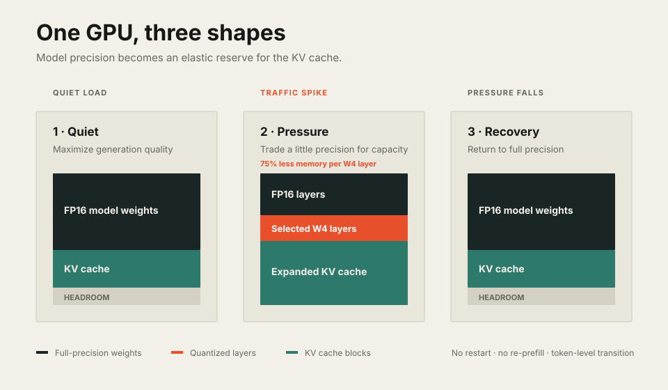

+++
title = 'MorphServe: Making Model Precision Elastic for Bursty LLM Serving'
date = 2026-05-24T00:00:00-04:00
author = 'Juncheng Yang'
draft = false
tags = ['LLM', 'inference', 'systems', 'quantization', 'KV-cache', 'serving']
showToc = true
summary = 'MorphServe temporarily converts selected model layers into KV-cache headroom when traffic spikes, then restores full precision when the pressure passes.'
+++

Most LLM servers treat a deployed model as fixed: its weights have one
precision, its KV cache has one memory budget, and both remain unchanged until
the process restarts.

<!--more-->

The workload is not nearly so well behaved. Production traces from Azure and
BurstGPT show request rates and token volumes rising and falling in sharp,
irregular bursts. A configuration sized for the average runs out of KV-cache
space at the peak. A configuration sized for the peak wastes expensive GPU
memory most of the day.

There are two familiar responses. Keep the model in full precision and accept
queueing when traffic spikes, or quantize the whole model and accept lower
quality all the time. Neither matches a workload that changes from second to
second.

In [MorphServe: Efficient and Workload-Aware LLM Serving via Runtime Quantized Layer Swapping and KV Cache Resizing](https://arxiv.org/pdf/2506.02006),
we ask whether model precision itself can become an elastic resource. Under
pressure, MorphServe temporarily replaces a few low-impact FP16 layers with
quantized versions and gives the freed memory to the KV cache. When the burst
passes, it releases those cache blocks and restores the full-precision layers.

The model changes shape while it is serving.

## The collision inside GPU memory

An LLM server has two large consumers of GPU memory.

The model weights are mostly fixed: every request uses the same transformer
layers. The KV cache is dynamic: it stores attention state for each active
sequence and grows with the number and length of requests. More concurrent
requests and longer contexts need more KV-cache blocks.

Under light load, a full-precision model and a modest KV cache fit together.
During a burst, the KV cache reaches its allocation limit. New requests wait
to begin prefilling, while decoding requests may be preempted, swapped to host
memory, or recomputed. Time to first token (TTFT) rises abruptly even if the
GPU still has useful compute capacity.

Static INT4 quantization creates more room, but it commits every token to the
quality cost of quantization—even when the server is quiet and full precision
would fit.

MorphServe treats that choice as temporary.

Replacing one FP16 layer with its weight-only INT4 counterpart can free up to
75% of that layer's weight memory. MorphServe does not use the saving to
load another model. It immediately turns the space into KV-cache blocks, so
the server can admit more prefills and keep more decoding requests active.

## Morphing without restarting a request

Changing weights in the middle of generation sounds dangerous. A naive
implementation might flush the model, discard attention state, or re-prefill
every active sequence.

MorphServe avoids all three. The KV cache carries the request's attention
history; changing the precision of a layer at a token boundary does not
invalidate that history. Early tokens in a response can use full precision,
a short interval during overload can use a mixed-precision model, and later
tokens can return to full precision.

Only the tokens generated during the pressure window see quantized layers.
The adaptation is state-preserving and happens without interrupting decoding.

Three components form the control loop:

| Component | Responsibility |
| --- | --- |
| Serving Monitor | Tracks GPU memory, queue depth, throughput, TTFT, and time per output token |
| Morphing Controller | Detects pressure and chooses how aggressively to adapt |
| Morphing Executor | Swaps layers and resizes KV-cache blocks on each worker |

The controller can favor accuracy or latency. An accuracy-oriented policy
swaps fewer layers and waits for greater pressure; a performance-oriented
policy responds more aggressively. This makes the policy a position on an
accuracy-latency frontier rather than a single global precision setting.

## Which layers can safely shrink?

Transformer layers do not respond equally to quantization. Replacing the wrong
layer may create much more output distortion than replacing another.
MorphServe therefore computes an offline Layer Importance Score for each
possible replacement.

The score combines three signals:

- How much the full-precision layer transforms its input.
- How much the quantized layer's output differs from the original.
- How much the replacement changes the complete model's output, given the
  layers already selected.

MorphServe greedily builds a swapping order from least to most sensitive. The
profile is stored with the model, so the runtime controller follows a prepared
sequence instead of running an expensive quality analysis during a traffic
spike.

The profile also generalizes reasonably beyond its calibration data. In the
paper, a sequence calibrated on WikiText-2 still outperformed front-to-back,
back-to-front, and random swapping orders when evaluated on C4.

## LayerSwapper: move weights while kernels keep running

At startup, MorphServe places full-precision, INT8, INT4, and INT3 layer
variants in pinned CPU memory. It precompiles the required inference kernels
and records each variant's address. The GPU begins with the ordinary
full-precision model.

When the controller requests a change, LayerSwapper copies the selected
quantized layer into the same GPU address as the full-precision layer. Using
the same address avoids pointer remapping. A separate CUDA stream performs
the copy while earlier transformer layers continue computing.

For Llama 2 7B, the paper reports roughly 0.4 GB for an FP16 decoder layer and
0.1 GB for its INT4 version. On PCIe Gen4, copying the INT4 weights takes
about 4 ms; the complete replacement, including reconstruction, takes about
6 ms. Because it overlaps with decoding, the measured time-per-output-token
overhead is negligible.

Restoring precision uses the backup FP16 layer in pinned CPU memory. The
mechanism is reversible: pressure changes the active representation, not the
model checkpoint.

## KVResizer: spend the savings where the queue hurts

Layer swapping creates memory. KVResizer decides how to use it.

KVResizer extends paged KV-cache management with on-demand block allocation
and release. It does not quantize or discard the attention state already
stored. When the request queue grows or free blocks run low, it maps the memory
released by LayerSwapper into new KV-cache blocks on a separate CUDA stream.

That helps both phases of serving:

- During prefill, more blocks let queued requests start sooner, reducing
  TTFT.
- During decode, more blocks keep active sequences resident, reducing
  preemption, host swapping, and recomputation.

When pressure falls, temporary blocks are detached and the corresponding
layers return to full precision. Weight precision and KV-cache capacity are
therefore two sides of one memory controller.

## What the experiments show

We evaluated MorphServe on Vicuna 7B, Llama 2 7B, Llama 3 8B, and CodeLlama
34B. The experiments use Azure LLM Inference and BurstGPT workload traces,
four generation datasets, NVIDIA L4 GPUs for the smaller models, and an A100
for CodeLlama.

Compared with full-precision serving, MorphServe:

- reduced average SLO violations by 92.45%;
- improved P95 TTFT by 2.2-3.9x in accuracy mode;
- pushed the saturation point out far enough to deliver 1.6-1.83x more
  throughput; and
- improved P99 time per output token by up to 1.23x by avoiding preemption
  stalls.

Accuracy mode kept F1 or ROUGE-L degradation between 0.11% and 2.18%,
while static INT4 serving degraded those metrics by 2.34-9.47% across the
evaluated configurations. Compared with static quantization, MorphServe
improved KV-cache memory utilization by 29.29%, expanded peak KV-cache use
up to 32.97% beyond the full-precision allocation, and cut queueing delay by
up to 3.8x.

The most important comparison is not that mixed precision can be faster than
FP16. It is that MorphServe pays the quality cost only when the alternative is
an overloaded server. Static quantization spends quality even when it buys
nothing.

## What to be careful about

Dynamic adaptation introduces its own assumptions.

First, the alternate layer variants live in pinned CPU memory. The design
depends on enough host capacity and PCIe bandwidth to make swaps overlap with
inference. Second, layer order is profiled offline. Although the profile
generalized across the paper's datasets, a model family or quantization method
with different sensitivity may need its own calibration.

Third, the evaluation covers four models up to 34B on single-GPU workers and
two replayed production traces. The traces were downscaled to fit the test
hardware. The paper explains how executors can operate independently under
data, tensor, pipeline, or sequence parallelism, but a full multi-GPU
evaluation remains important.

Finally, F1 and ROUGE-L capture task output quality, not every way a temporary
precision change could matter. Deployments with strict factuality, safety, or
reproducibility requirements should choose conservative thresholds and
evaluate their own outputs.

## Precision is now a scheduling decision

Quantization is usually described as a model transformation performed before
deployment. MorphServe reframes it as a short-lived systems action:

> Quantize the least sensitive layers only when their memory is more valuable
> as request state.

This connects model quality directly to queue pressure. It also suggests a
broader direction for inference systems. Precision, cache capacity, batch
size, and admission control should not be separate static knobs. They are
different ways to spend the same GPU budget.

The best configuration is not one fixed point. It is a controller that moves
with the workload.

This post is based on the great work done by students, [MorphServe: Efficient and Workload-Aware LLM Serving via Runtime Quantized Layer Swapping and KV Cache Resizing](https://arxiv.org/abs/2506.02006).
